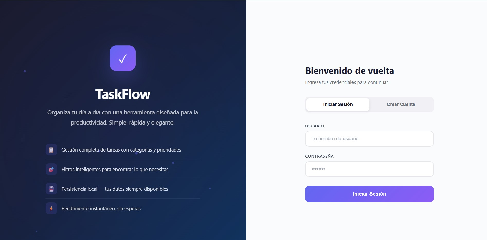
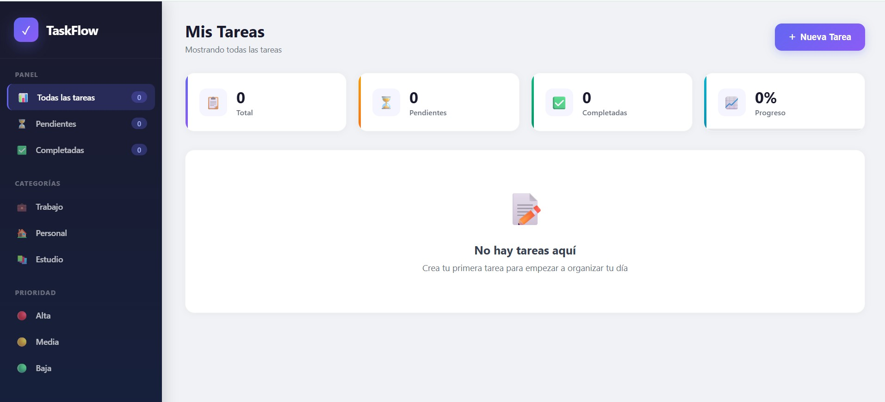
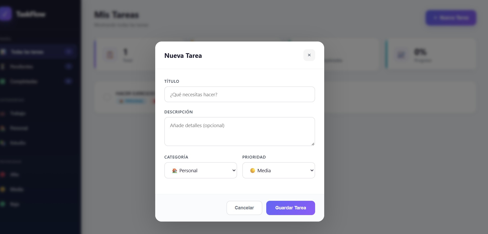
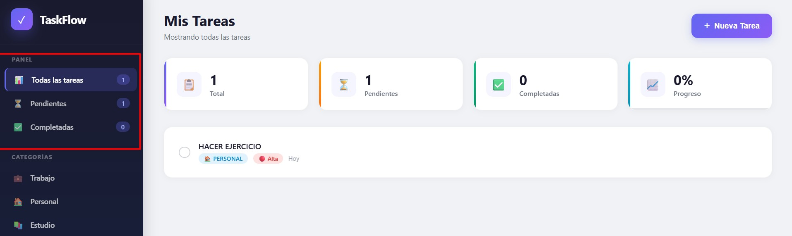

# TaskFlow — Gestor de Tareas Personal

> **Actividad 1** — Desarrollo de aplicaciones con asistentes de programación basados en IA  
> **Universidad:** UNIR — Universidad Internacional de La Rioja  
> **Estudiante:** Alan Druet  
> **Asignatura:** Generación de Código y Automatización en Desarrollo de Software con IA 
> **Fecha:** 27/06/2026

---

## Descripción

TaskFlow es una aplicación web de gestión de tareas personales desarrollada en Go. Permite registrarse, iniciar sesión y organizar tareas con categorías, prioridades y filtros. Se ejecuta con Docker sin necesidad de instalar dependencias adicionales.

**Repositorio:** https://github.com/adruro/unir-practice-generate-code-1

---

## Características

- Autenticación de usuarios (registro/login)
- CRUD completo de tareas
- Categorías: Trabajo, Personal, Estudio
- Prioridades: Alta, Media, Baja
- Filtros combinados por estado, categoría y prioridad
- Interfaz web moderna con animaciones y diseño responsive
- Persistencia en base de datos SQLite
- Despliegue con Docker (un solo comando)

---

## Inicio Rápido

### Requisitos

- [Docker](https://www.docker.com/products/docker-desktop/) instalado

### Ejecutar

```bash
# Clonar el repositorio
git clone https://github.com/adruro/unir-practice-generate-code-1.git
cd unir-practice-generate-code-1

# Construir e iniciar con Docker
make docker-up

# Abrir en el navegador
# http://localhost:3000
```

### Detener

```bash
make docker-stop
```

---

## Comandos Make

| Comando | Descripción |
|---------|-------------|
| `make docker-up` | Construye e inicia la app (todo en uno) |
| `make docker-run` | Inicia si ya está construida |
| `make docker-stop` | Detiene el contenedor |
| `make docker-logs` | Ver logs en tiempo real |
| `make docker-build` | Solo construye la imagen |
| `make deps` | Descarga dependencias de Go |
| `make fmt` | Formatea el código |
| `make help` | Muestra todos los comandos |

---

## Stack Tecnológico

| Componente | Tecnología |
|------------|------------|
| Lenguaje | Go 1.24 |
| Router | Chi v5 |
| Base de datos | SQLite 3 |
| Frontend | HTML5, CSS3, JavaScript vanilla |
| Deploy | Docker + Docker Compose |
| Build tool | Makefile |

---

## Estructura del Proyecto

```
├── cmd/taskflow/main.go       # Punto de entrada
├── internal/
│   ├── handler/               # Controladores HTTP
│   ├── model/                 # Modelos de datos
│   ├── repository/            # Acceso a datos (SQLite)
│   └── service/               # Lógica de negocio
├── web/
│   ├── templates/             # HTML (login, dashboard)
│   ├── static/                # CSS y JavaScript
│   └── embed.go               # Embebido de archivos
├── docs/                      # Documentación e informe
├── Dockerfile                 # Multi-stage build
├── docker-compose.yml         # Orquestación
├── Makefile                   # Automatización
└── go.mod                     # Dependencias
```

---

## Variables de Entorno

| Variable | Descripción | Default |
|----------|-------------|---------|
| `TASKFLOW_PORT` | Puerto interno del servidor | `8080` |
| `TASKFLOW_DB` | Ruta de la base de datos | `taskflow.db` |

---

## Documentación

- [`docs/definicion-proyecto.md`](docs/definicion-proyecto.md) — Requisitos funcionales y no funcionales

---

## Capturas de Pantalla

### Pantalla de Login


### Dashboard


### Crear Tarea


### Filtros Activos


---

## Licencia

Proyecto académico — UNIR 2026
